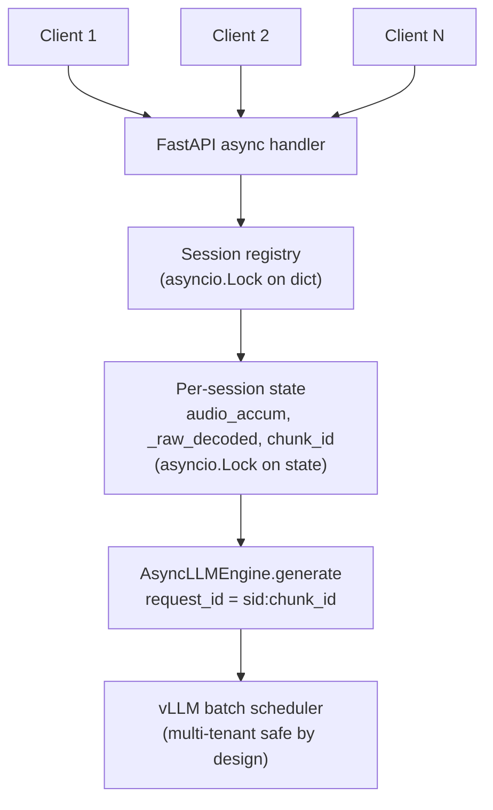
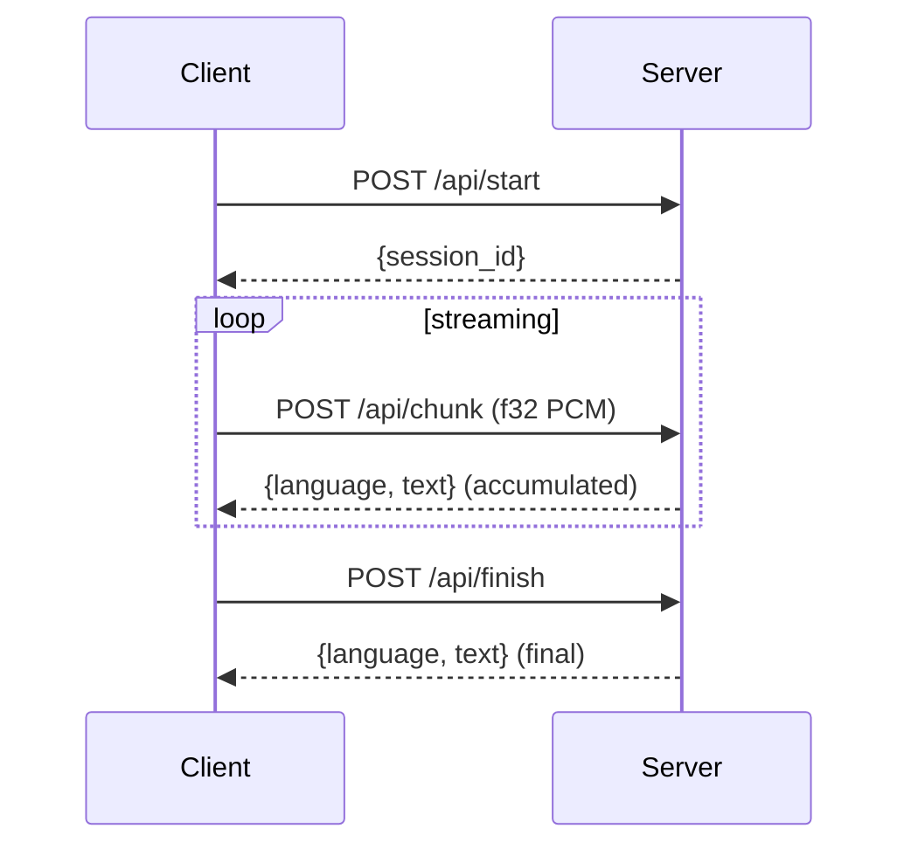

<div align="center">

# qasr-mt

**English** | [简体中文](README.zh-CN.md) | [繁體中文](README.zh-TW.md)

**Multi-tenant streaming ASR server for [Qwen3-ASR](https://github.com/QwenLM/Qwen3-ASR).**

A production-safe drop-in replacement for the upstream `qwen-asr-demo-streaming`
Flask demo &mdash; with per-session isolation, LID metadata sanitisation, and the
SDK&rsquo;s rolling-decode UX intact.

[](https://opensource.org/licenses/Apache-2.0)
[](https://www.python.org)
[](https://github.com/vllm-project/vllm)
[](https://huggingface.co/Qwen/Qwen3-ASR-0.6B)
[](https://developer.nvidia.com/cuda-downloads)
[](https://github.com/jayter-official/qwen3-asr-mt/stargazers)

</div>

---

## Quickstart

```bash
git clone https://github.com/jayter-official/qwen3-asr-mt
cd qwen3-asr-mt
docker compose up -d           # first boot downloads Qwen3-ASR-0.6B (~1.5 GB)
docker compose logs -f         # wait for "Application startup complete"

# concurrent smoke test — two parallel sessions, asserts no cross-talk
python tests/smoke_concurrent.py path/to/test.wav http://localhost:8111
```

**Requirements**: NVIDIA GPU with CUDA 12.8+ driver (RTX 3090 verified, any
Ampere+ should work), NVIDIA Container Toolkit, ~8&ndash;10 GB VRAM at the
default `QASR_GPU_MEM_UTIL=0.35`.

## Architecture



Two invariants make concurrency safe:

1. **Engine isolation.** Every `engine.generate()` uses a unique `request_id`.
   vLLM&rsquo;s scheduler may interleave requests from different sessions inside one
   GPU batch, but keeps KV cache and output tokens strictly per-request. This
   is the contract `AsyncLLMEngine` is built around and what `vllm serve`
   relies on in production.
2. **State isolation.** Each session owns its own audio buffer, accumulated
   audio, chunk counter, and prefix. A per-session `asyncio.Lock` prevents
   same-session chunks from re-entering the rolling-decode loop concurrently.

See [`docs/ARCHITECTURE.md`](docs/ARCHITECTURE.md) for the full discussion,
including why the `vllm.LLM` (offline) path inside the upstream demo is not
safe to share across threads.

## API

Identical surface to `qwen-asr-demo-streaming`. Audio body is raw float32
little-endian PCM at 16&nbsp;kHz, mono, no WAV header.



### `POST /api/start`

Query param `language=Chinese|English|...` (optional) forces text-only output.

```json
{"session_id": "cb3a53d4bf1f42558b4fd2f65f3376b2"}
```

### `POST /api/chunk?session_id=<id>`

Header `Content-Type: application/octet-stream`. Body: any length of float32
PCM. The server buffers until `chunk_size_sec` worth has accumulated, then
runs one rolling-decode step and returns the **accumulated** transcription
(not just the delta).

```json
{"language": "Chinese", "text": "這是 Qwen3-ASR 串流辨識的測試句"}
```

### `POST /api/finish?session_id=<id>`

Flushes any tail audio shorter than one chunk, runs a final decode, deletes
the session.

### `GET /health`

Readiness probe. Returns `{"ready": true, "sessions": N}` once the engine
finishes warmup.

Full API reference: [`docs/API.md`](docs/API.md).

## Configuration

All knobs are environment variables (or CLI flags if running standalone):

| Variable | Default | Meaning |
|----------|---------|---------|
| `QASR_MODEL` | `Qwen/Qwen3-ASR-0.6B` | HF repo id or local path. |
| `QASR_CHUNK_SIZE_SEC` | `1.0` | Decode a new segment every N seconds of audio. |
| `QASR_UNFIXED_CHUNK_NUM` | `4` | First N chunks skip prefix conditioning. |
| `QASR_UNFIXED_TOKEN_NUM` | `5` | Roll back last K tokens each decode for boundary revision. |
| `QASR_GPU_MEM_UTIL` | `0.35` | vLLM GPU memory fraction; lower when sharing the GPU. |
| `QASR_MAX_MODEL_LEN` | `8192` | Max context length; tune for very long audio. |
| `QASR_MAX_NEW_TOKENS` | `32` | Tokens generated per decode step. |
| `QASR_SESSION_TTL_SEC` | `600` | Idle session GC. |
| `QASR_DTYPE` | `auto` | `auto` / `bfloat16` / `float16` / `float32`. |
| `QASR_PORT` | `8000` | Listen port (container-internal). |

## Why this exists

Upstream state as of April 2026:

| Option | Status |
|--------|--------|
| `qwen-asr-demo-streaming` (Flask) | ⚠️ Single stream only. Documented limitation. Race on concurrent use. |
| `vllm serve` + `/v1/audio/transcriptions` | ✅ Multi-tenant safe but **batch-only** &mdash; no partial transcriptions. |
| `vllm serve` + `/v1/realtime` WebSocket | ⚠️ Known bugs: LID prefix leaks, 5&nbsp;s segment boundary overlap, no rollback protocol. See [vllm#35767](https://github.com/vllm-project/vllm/issues/35767). |
| `vllm#35894` (community fix) | ⏳ Draft PR, 36 days inactive (as of 2026-04-23), architectural concerns in [vllm#35908](https://github.com/vllm-project/vllm/issues/35908). |

If you need **streaming transcription with partial results shown live, served
to multiple concurrent users, in production, today**, none of the above fit.

**qasr-mt** takes the SDK&rsquo;s battle-tested rolling-decode / prefix-rollback
streaming logic and wires it to `AsyncLLMEngine`, giving you the demo&rsquo;s
UX with production safety. Full diagnostic story in [`docs/WHY.md`](docs/WHY.md).

## Benchmarks

Measured on a single RTX 3090 with `QASR_GPU_MEM_UTIL=0.35`:

| Scenario | Per-chunk latency | Cold start |
|----------|------------------|------------|
| 1 concurrent session | 0.5&ndash;0.6 s | ~8 s (graph compile) |
| 2 concurrent sessions | 0.5&ndash;0.6 s | same |

vLLM&rsquo;s own benchmark claims up to 128 concurrent streams on Qwen3-ASR-0.6B
with RTF 0.064. We have not yet pushed beyond 2. PRs welcome.

## Comparison with upstream demo

|  | `qwen-asr-demo-streaming` | **qasr-mt** |
|---|---|---|
| Engine | `vllm.LLM` (offline API) | `vllm.AsyncLLMEngine` |
| Web framework | Flask (sync, `threaded=True`) | FastAPI (native async) |
| Concurrent streams | **Unsafe** (documented as single-stream) | Safe, tested |
| LID metadata leak to client | Observed on rolling-decode boundary | Stripped (`parse_asr_output` + regex) |
| `force_language` | Yes | Yes |
| Rolling decode (`unfixed_chunk_num` / `unfixed_token_num`) | Yes | Yes &mdash; logic ported verbatim |
| Timestamps | No | No |
| HTTP API shape | `/api/{start,chunk,finish}` | **Same** (drop-in) |

## Documentation

- [`docs/WHY.md`](docs/WHY.md) &mdash; the full diagnostic story: how the upstream concurrency bug was discovered and why `AsyncLLMEngine` is the right fix.
- [`docs/ARCHITECTURE.md`](docs/ARCHITECTURE.md) &mdash; detailed design: lock ordering, rolling decode algorithm, LID sanitisation.
- [`docs/API.md`](docs/API.md) &mdash; complete HTTP API reference.

## Credits

- [**Qwen3-ASR**](https://github.com/QwenLM/Qwen3-ASR) by the Qwen team &mdash;
  the model and the SDK rolling-decode algorithm this server reuses.
- [**vLLM**](https://github.com/vllm-project/vllm) &mdash; `AsyncLLMEngine`,
  chunked prefill, PagedAttention.
- vLLM community discussion [#35767](https://github.com/vllm-project/vllm/issues/35767)
  and [#35908](https://github.com/vllm-project/vllm/issues/35908) &mdash; clarified
  what the upstream realtime endpoint does and does not solve.

## Star History

[](https://star-history.com/#jayter-official/qwen3-asr-mt&Date)

## License

[Apache License 2.0](LICENSE). Same licence as Qwen3-ASR and vLLM.
