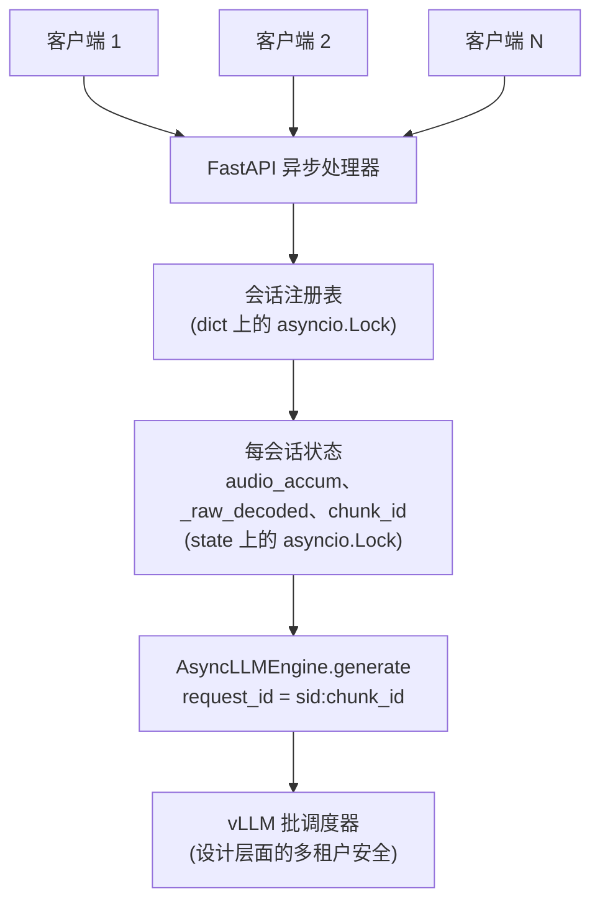
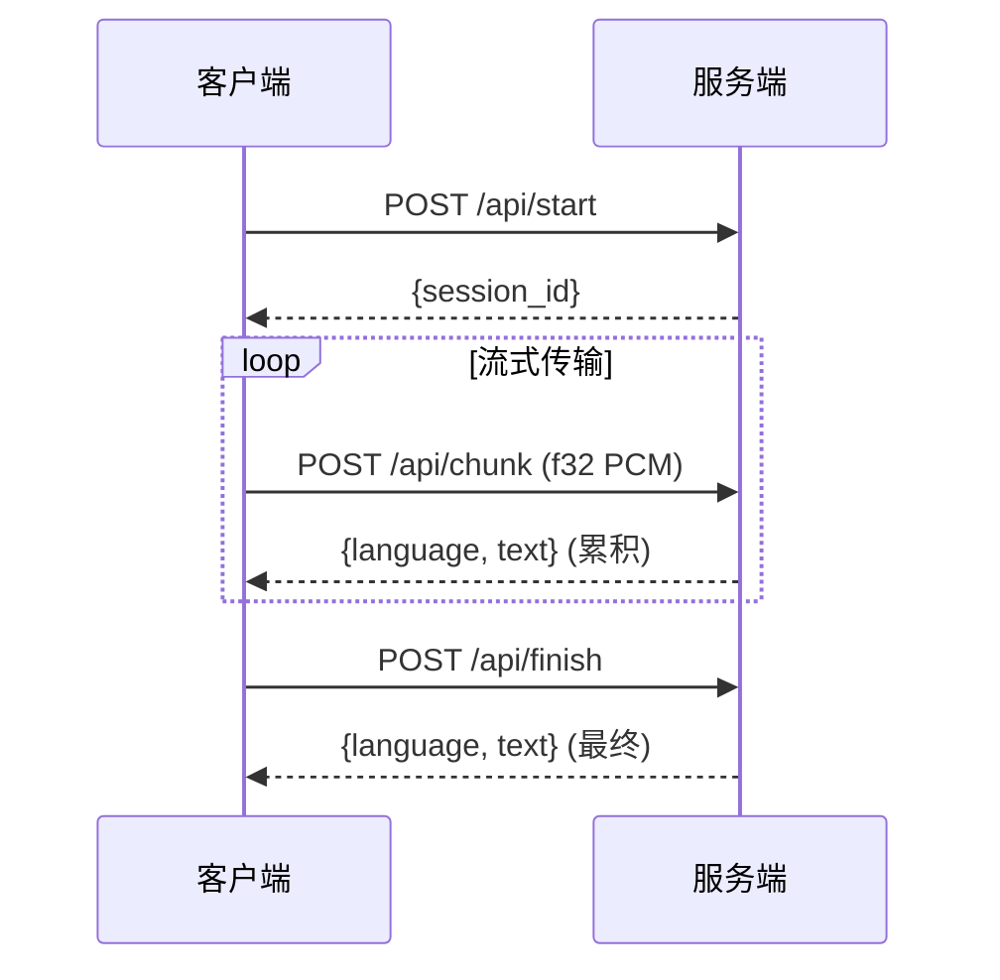

<div align="center">

# qasr-mt

[English](README.md) | **简体中文** | [繁體中文](README.zh-TW.md)

**[Qwen3-ASR](https://github.com/QwenLM/Qwen3-ASR) 的多租户流式语音识别服务。**

直接替换上游 `qwen-asr-demo-streaming` Flask demo 的生产级实现，提供每会话隔离、LID
元数据清理，并完整保留 SDK 的滚动解码交互体验。

[](https://opensource.org/licenses/Apache-2.0)
[](https://www.python.org)
[](https://github.com/vllm-project/vllm)
[](https://huggingface.co/Qwen/Qwen3-ASR-0.6B)
[](https://developer.nvidia.com/cuda-downloads)
[](https://github.com/jayter-official/qwen3-asr-mt/stargazers)

</div>

---

## 快速开始

```bash
git clone https://github.com/jayter-official/qwen3-asr-mt
cd qwen3-asr-mt
docker compose up -d           # 首次启动会下载 Qwen3-ASR-0.6B（约 1.5 GB）
docker compose logs -f         # 等待出现 "Application startup complete"

# 并发冒烟测试 —— 两路并行会话，自动断言无串话
python tests/smoke_concurrent.py path/to/test.wav http://localhost:8111
```

**环境要求**：NVIDIA GPU，CUDA 12.8+ 驱动（RTX 3090 实测通过，任何 Ampere 及以上架构
应可工作）；NVIDIA Container Toolkit；在默认 `QASR_GPU_MEM_UTIL=0.35` 下约需
8&ndash;10 GB 显存。

## 架构



并发安全建立在两个不变量之上：

1. **引擎隔离。** 每次 `engine.generate()` 调用都使用唯一的 `request_id`。vLLM
   的调度器会把不同会话的请求在同一个 GPU batch 中交错执行，但 KV cache 和输出
   token 严格按 request 隔离。这是 `AsyncLLMEngine` 的设计契约，也是 `vllm serve`
   在生产环境中依赖的基础。
2. **状态隔离。** 每个会话拥有独立的音频缓冲、累计音频、chunk 计数和 prefix。
   每会话独占一把 `asyncio.Lock`，避免同会话的 chunk 并发重入滚动解码循环。

完整讨论（包括上游 demo 中 `vllm.LLM` 离线 API 为什么不是跨线程安全）见
[`docs/ARCHITECTURE.md`](docs/ARCHITECTURE.md)。

## API

接口形状与 `qwen-asr-demo-streaming` 完全一致。音频 body 为裸 float32 小端
PCM，16&nbsp;kHz，单声道，无 WAV 头。



### `POST /api/start`

查询参数 `language=Chinese|English|...`（可选）强制输出为纯文本。

```json
{"session_id": "cb3a53d4bf1f42558b4fd2f65f3376b2"}
```

### `POST /api/chunk?session_id=<id>`

请求头 `Content-Type: application/octet-stream`。Body 为任意长度的 float32 PCM。
服务端先缓冲，累计够 `chunk_size_sec` 后跑一次滚动解码，返回**累计**识别结果
（不是增量）。

```json
{"language": "Chinese", "text": "这是 Qwen3-ASR 流式识别的测试句"}
```

### `POST /api/finish?session_id=<id>`

冲刷掉不足一个 chunk 的尾部音频，跑最后一次解码，删除会话。

### `GET /health`

就绪探针。引擎预热完成后返回 `{"ready": true, "sessions": N}`。

完整 API 参考见 [`docs/API.md`](docs/API.md)。

## 配置

所有参数均可通过环境变量设置（独立运行时也可用命令行参数）：

| 变量 | 默认值 | 含义 |
|------|--------|------|
| `QASR_MODEL` | `Qwen/Qwen3-ASR-0.6B` | HF repo id 或本地路径。 |
| `QASR_CHUNK_SIZE_SEC` | `1.0` | 每累计 N 秒音频解码一次。 |
| `QASR_UNFIXED_CHUNK_NUM` | `4` | 前 N 个 chunk 不使用前缀条件。 |
| `QASR_UNFIXED_TOKEN_NUM` | `5` | 每次解码回滚最后 K 个 token，用于边界修正。 |
| `QASR_GPU_MEM_UTIL` | `0.35` | vLLM 显存占比；与其他服务共享 GPU 时调低。 |
| `QASR_MAX_MODEL_LEN` | `8192` | 最大上下文长度；处理超长音频时调大。 |
| `QASR_MAX_NEW_TOKENS` | `32` | 每一步解码生成的 token 数。 |
| `QASR_SESSION_TTL_SEC` | `600` | 空闲会话回收时间。 |
| `QASR_DTYPE` | `auto` | `auto` / `bfloat16` / `float16` / `float32`。 |
| `QASR_PORT` | `8000` | 监听端口（容器内）。 |

## 为什么需要这个项目

截至 2026 年 4 月，上游各方案现状：

| 方案 | 状态 |
|------|------|
| `qwen-asr-demo-streaming`（Flask） | ⚠️ 仅支持单路流。文档明确说明的限制，并发使用会产生竞争。 |
| `vllm serve` + `/v1/audio/transcriptions` | ✅ 多租户安全，但**仅批处理** &mdash; 没有部分识别结果。 |
| `vllm serve` + `/v1/realtime` WebSocket | ⚠️ 已知问题：LID 前缀泄漏、硬编码 5&nbsp;s 段边界重叠、无回滚协议。详见 [vllm#35767](https://github.com/vllm-project/vllm/issues/35767)。 |
| `vllm#35894`（社区修复） | ⏳ Draft PR，停摆 36 天（截至 2026-04-23），架构争议见 [vllm#35908](https://github.com/vllm-project/vllm/issues/35908)。 |

如果你需要**实时显示部分识别结果、多用户并发、可以直接上生产的流式语音识别服务**，
以上任何方案都无法同时满足。

**qasr-mt** 保留 SDK 久经验证的滚动解码 / 前缀回滚逻辑，将底层引擎换成
`AsyncLLMEngine`，在维持 demo 交互体验的同时获得生产级安全性。完整诊断过程见
[`docs/WHY.md`](docs/WHY.md)。

## 性能数据

单卡 RTX 3090，`QASR_GPU_MEM_UTIL=0.35` 下：

| 场景 | 每 chunk 延迟 | 冷启动 |
|------|-------------|--------|
| 1 路并发 | 0.5&ndash;0.6 s | 约 8 s（图编译） |
| 2 路并发 | 0.5&ndash;0.6 s | 同上 |

vLLM 官方数据表明 Qwen3-ASR-0.6B 在单卡上可达 128 路并发，RTF 0.064。本项目目前
实测仅到 2 路，欢迎社区提交更大规模的基准测试 PR。

## 与上游 demo 对比

|  | `qwen-asr-demo-streaming` | **qasr-mt** |
|---|---|---|
| 引擎 | `vllm.LLM`（离线 API） | `vllm.AsyncLLMEngine` |
| Web 框架 | Flask（同步，`threaded=True`） | FastAPI（原生异步） |
| 并发流 | **不安全**（文档明示单流） | 安全，已测试 |
| LID 元数据泄漏到客户端 | 在滚动解码边界处观测到 | 已清理（`parse_asr_output` + 正则兜底） |
| `force_language` | 支持 | 支持 |
| 滚动解码（`unfixed_chunk_num` / `unfixed_token_num`） | 支持 | 支持 &mdash; 逻辑原样移植 |
| 时间戳 | 不支持 | 不支持 |
| HTTP API 形状 | `/api/{start,chunk,finish}` | **完全相同**（直接替换） |

## 文档

- [`docs/WHY.md`](docs/WHY.md) &mdash; 完整诊断故事：上游并发 bug 是如何被发现的，以及为什么 `AsyncLLMEngine` 是正确的修复方向。
- [`docs/ARCHITECTURE.md`](docs/ARCHITECTURE.md) &mdash; 详细设计：锁的获取顺序、滚动解码算法、LID 清理策略。
- [`docs/API.md`](docs/API.md) &mdash; 完整 HTTP API 参考。

## 致谢

- [**Qwen3-ASR**](https://github.com/QwenLM/Qwen3-ASR) &mdash; 由 Qwen 团队开源。本项目复用了其模型以及 SDK 的滚动解码算法。
- [**vLLM**](https://github.com/vllm-project/vllm) &mdash; `AsyncLLMEngine`、分块预填充（chunked prefill）、PagedAttention。
- vLLM 社区讨论 [#35767](https://github.com/vllm-project/vllm/issues/35767) 和 [#35908](https://github.com/vllm-project/vllm/issues/35908) &mdash; 厘清了上游 realtime endpoint 已解决和未解决的部分。

## Star 曲线

[](https://star-history.com/#jayter-official/qwen3-asr-mt&Date)

## 许可证

[Apache License 2.0](LICENSE)。与 Qwen3-ASR 和 vLLM 相同。
