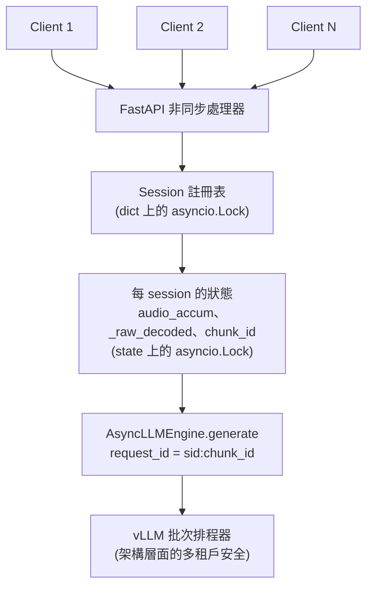
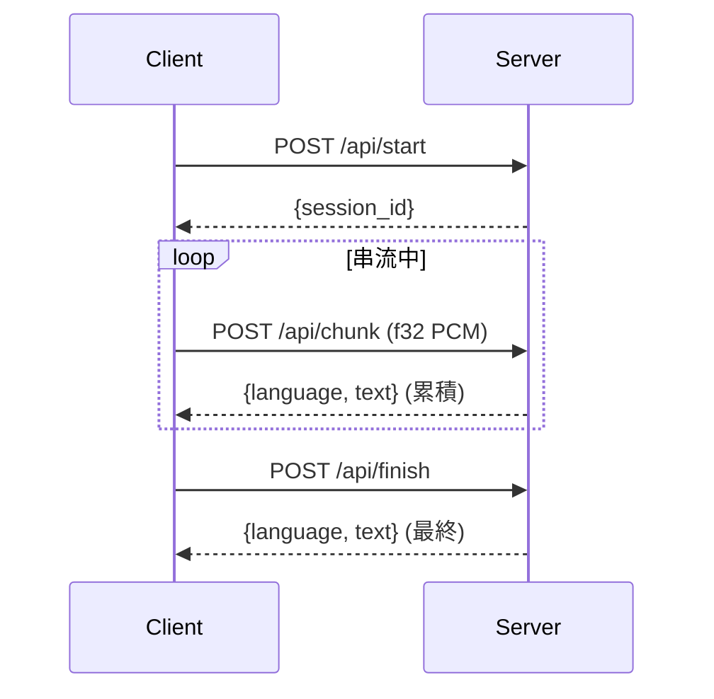

<div align="center">

# qasr-mt

[English](README.md) | [简体中文](README.zh-CN.md) | **繁體中文**

**[Qwen3-ASR](https://github.com/QwenLM/Qwen3-ASR) 的多租戶串流語音辨識服務。**

可直接替換上游 `qwen-asr-demo-streaming` Flask demo 的生產級實作，提供每個 session
獨立隔離、LID metadata 清理，並完整保留 SDK 的滾動解碼互動體驗。

[](https://opensource.org/licenses/Apache-2.0)
[](https://www.python.org)
[](https://github.com/vllm-project/vllm)
[](https://huggingface.co/Qwen/Qwen3-ASR-0.6B)
[](https://developer.nvidia.com/cuda-downloads)
[](https://github.com/jayter-official/qwen3-asr-mt/stargazers)

</div>

---

## 快速開始

```bash
git clone https://github.com/jayter-official/qwen3-asr-mt
cd qwen3-asr-mt
docker compose up -d           # 首次啟動會下載 Qwen3-ASR-0.6B（約 1.5 GB）
docker compose logs -f         # 等待出現 "Application startup complete"

# 並發冒煙測試 —— 兩路平行 session，自動驗證無串話
python tests/smoke_concurrent.py path/to/test.wav http://localhost:8111
```

**環境需求**：NVIDIA GPU，CUDA 12.8+ 驅動（RTX 3090 實測通過，任何 Ampere 以上架構
應可運作）；NVIDIA Container Toolkit；在預設 `QASR_GPU_MEM_UTIL=0.35` 下約需
8&ndash;10 GB VRAM。

## 架構



並發安全建立在兩個不變量之上：

1. **Engine 隔離。** 每次 `engine.generate()` 呼叫都使用唯一的 `request_id`。
   vLLM 的排程器可以把不同 session 的請求交錯進同一個 GPU batch，但 KV cache
   與輸出 token 會嚴格依 request 隔離。這是 `AsyncLLMEngine` 的設計契約，也是
   `vllm serve` 在正式環境賴以運作的基礎。
2. **狀態隔離。** 每個 session 擁有獨立的音訊 buffer、累積音訊、chunk 計數與
   prefix。每個 session 一把 `asyncio.Lock`，避免同 session 的 chunk 並發重入
   滾動解碼流程。

完整討論（包括上游 demo 中 `vllm.LLM` 離線 API 為何不是跨執行緒安全）見
[`docs/ARCHITECTURE.md`](docs/ARCHITECTURE.md)。

## API

介面與 `qwen-asr-demo-streaming` 完全相同。音訊 body 為裸 float32 little-endian
PCM，16&nbsp;kHz，單聲道，無 WAV 標頭。



### `POST /api/start`

查詢參數 `language=Chinese|English|...`（可選）可強制輸出為純文字。

```json
{"session_id": "cb3a53d4bf1f42558b4fd2f65f3376b2"}
```

### `POST /api/chunk?session_id=<id>`

Header `Content-Type: application/octet-stream`。Body 為任意長度的 float32 PCM。
Server 會先緩衝，累積到 `chunk_size_sec` 後執行一次滾動解碼，回傳**累積**辨識
結果（而不是 delta）。

```json
{"language": "Chinese", "text": "這是 Qwen3-ASR 串流辨識的測試句"}
```

### `POST /api/finish?session_id=<id>`

沖掉不足一個 chunk 的尾端音訊，跑最後一次解碼，刪除該 session。

### `GET /health`

Readiness probe。引擎預熱完成後回傳 `{"ready": true, "sessions": N}`。

完整 API 參考見 [`docs/API.md`](docs/API.md)。

## 設定

所有參數都可透過環境變數設定（獨立執行時也可用 CLI flag）：

| 變數 | 預設值 | 意義 |
|------|--------|------|
| `QASR_MODEL` | `Qwen/Qwen3-ASR-0.6B` | HF repo id 或本地路徑。 |
| `QASR_CHUNK_SIZE_SEC` | `1.0` | 每累積 N 秒音訊解碼一次。 |
| `QASR_UNFIXED_CHUNK_NUM` | `4` | 前 N 個 chunk 不套用 prefix 條件。 |
| `QASR_UNFIXED_TOKEN_NUM` | `5` | 每次解碼回滾最後 K 個 token，用於邊界修正。 |
| `QASR_GPU_MEM_UTIL` | `0.35` | vLLM 顯示記憶體占比；與其他服務共享 GPU 時調低。 |
| `QASR_MAX_MODEL_LEN` | `8192` | 最大上下文長度；處理超長音訊時調高。 |
| `QASR_MAX_NEW_TOKENS` | `32` | 每步解碼產生的 token 數。 |
| `QASR_SESSION_TTL_SEC` | `600` | 閒置 session 回收時間。 |
| `QASR_DTYPE` | `auto` | `auto` / `bfloat16` / `float16` / `float32`。 |
| `QASR_PORT` | `8000` | 監聽埠（容器內）。 |

## 為什麼需要這個專案

截至 2026 年 4 月，上游各方案現況：

| 方案 | 狀態 |
|------|------|
| `qwen-asr-demo-streaming`（Flask） | ⚠️ 只支援單路串流。文件明確寫的限制，並發使用時會發生 race condition。 |
| `vllm serve` + `/v1/audio/transcriptions` | ✅ 多租戶安全，但**只能批次** &mdash; 無法取得部分辨識結果。 |
| `vllm serve` + `/v1/realtime` WebSocket | ⚠️ 已知問題：LID prefix 外洩、寫死 5&nbsp;s 段落邊界重疊、無回滾協議。詳見 [vllm#35767](https://github.com/vllm-project/vllm/issues/35767)。 |
| `vllm#35894`（社群修復） | ⏳ Draft PR，停擺 36 天（截至 2026-04-23），架構爭議見 [vllm#35908](https://github.com/vllm-project/vllm/issues/35908)。 |

如果你需要**即時顯示部分辨識結果、多人並發、可直接上線的串流語音辨識服務**，
以上任何方案都無法同時滿足。

**qasr-mt** 保留 SDK 已久經驗證的滾動解碼 / prefix rollback 邏輯，把底層引擎換成
`AsyncLLMEngine`，兼顧 demo 的互動體驗與正式環境的安全性。完整診斷過程見
[`docs/WHY.md`](docs/WHY.md)。

## 效能數據

單張 RTX 3090，`QASR_GPU_MEM_UTIL=0.35` 下：

| 場景 | 每 chunk 延遲 | 冷啟動 |
|------|-------------|--------|
| 1 路並發 | 0.5&ndash;0.6 s | 約 8 s（圖形編譯） |
| 2 路並發 | 0.5&ndash;0.6 s | 同上 |

vLLM 官方 benchmark 指出 Qwen3-ASR-0.6B 單卡可達 128 路並發，RTF 0.064。本專案
目前實測只到 2 路，歡迎社群 PR 補上更大規模的壓測結果。

## 與上游 demo 對比

|  | `qwen-asr-demo-streaming` | **qasr-mt** |
|---|---|---|
| 引擎 | `vllm.LLM`（離線 API） | `vllm.AsyncLLMEngine` |
| Web 框架 | Flask（同步，`threaded=True`） | FastAPI（原生非同步） |
| 並發串流 | **不安全**（文件明示單流限制） | 安全，已驗證 |
| LID metadata 外洩到 client | 在滾動解碼邊界處觀測到 | 已清理（`parse_asr_output` + regex 兜底） |
| `force_language` | 支援 | 支援 |
| 滾動解碼（`unfixed_chunk_num` / `unfixed_token_num`） | 支援 | 支援 &mdash; 邏輯原樣移植 |
| 時間戳 | 不支援 | 不支援 |
| HTTP API 介面 | `/api/{start,chunk,finish}` | **完全相同**（直接替換） |

## 文件

- [`docs/WHY.md`](docs/WHY.md) &mdash; 完整診斷故事：上游並發 bug 如何被發現，以及為何 `AsyncLLMEngine` 才是正確的修復方向。
- [`docs/ARCHITECTURE.md`](docs/ARCHITECTURE.md) &mdash; 詳細設計：鎖的取得順序、滾動解碼演算法、LID 清理策略。
- [`docs/API.md`](docs/API.md) &mdash; 完整 HTTP API 參考。

## 致謝

- [**Qwen3-ASR**](https://github.com/QwenLM/Qwen3-ASR) &mdash; 由 Qwen 團隊開源。本專案沿用其模型與 SDK 的滾動解碼演算法。
- [**vLLM**](https://github.com/vllm-project/vllm) &mdash; `AsyncLLMEngine`、chunked prefill、PagedAttention。
- vLLM 社群討論 [#35767](https://github.com/vllm-project/vllm/issues/35767) 與 [#35908](https://github.com/vllm-project/vllm/issues/35908) &mdash; 釐清了上游 realtime endpoint 已處理與未處理的問題。

## Star 曲線

[](https://star-history.com/#jayter-official/qwen3-asr-mt&Date)

## 授權

[Apache License 2.0](LICENSE)。與 Qwen3-ASR、vLLM 相同。
